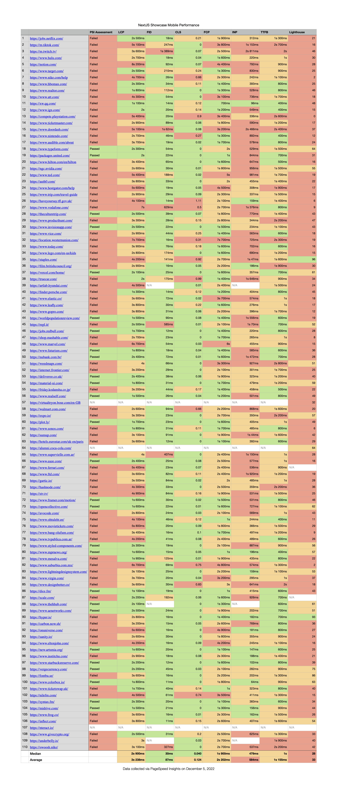
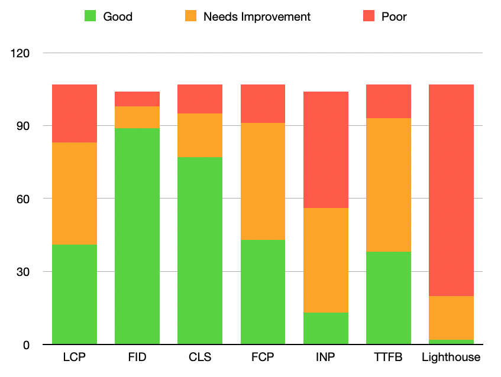
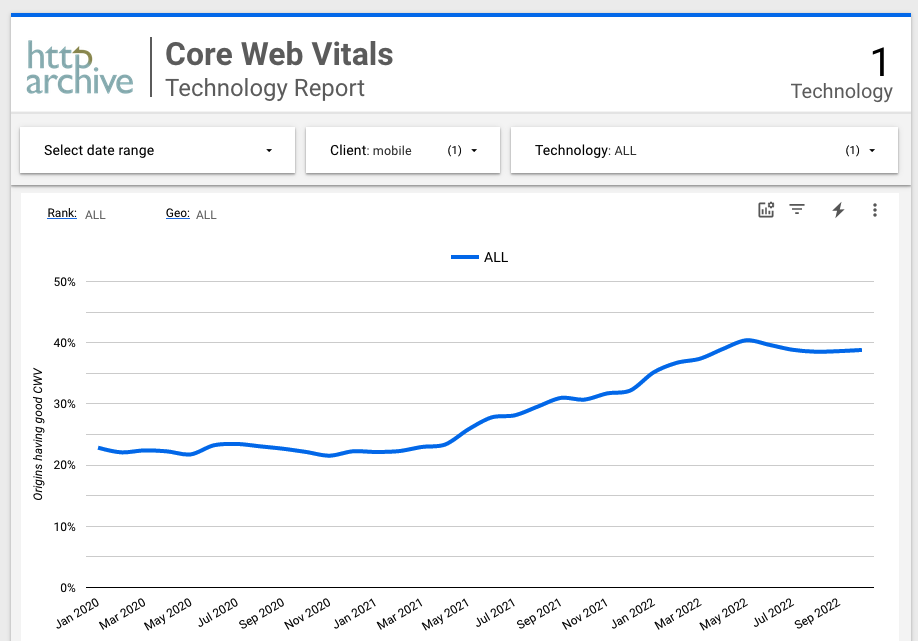
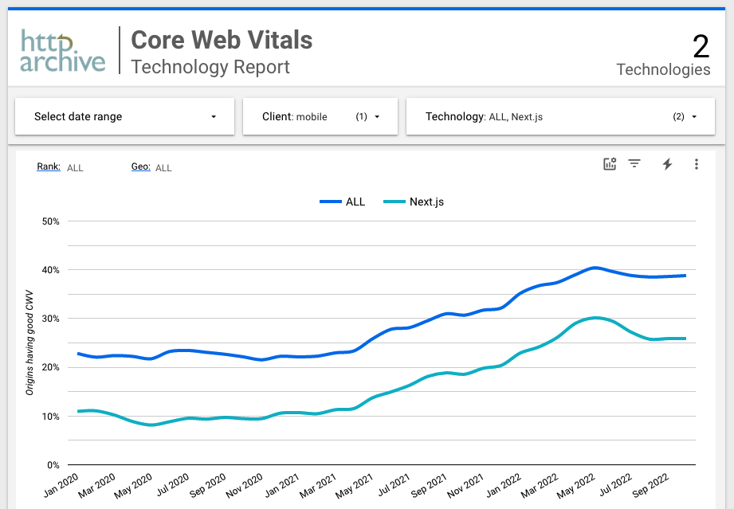

# Mobile Performance of Next.js Sites

## Background

Next.js is one of the most popular React frameworks and is seeing heavy adoption.
I am working on performance remediation for a large e-commerce site built with Next. While the site has numerous 3rd party analytics, observability, and clientside A/B testing scripts, the performance bottlenecks I am facing are primarily due to large app, vendor, and framework JavaScript bundles.

## Mobile Web Performance

While modern phones often sport impressive specs similar to desktop ones, due to thermal constraints, network volatility, and the additional necessary background work, only a portion of that device power translates to web performance. Progressive Performance (Chrome Dev Summit 2016) is a great talk that goes into the constraints of mobile devices and the impact on performance. [Youtube link](https://www.youtube.com/watch?v=4bZvq3nodf4)

For my project, mobile performance is my most significant concern; desktop scores are mostly acceptable. 75% of site traffic comes from mobile, and the site has failing Core Web Vital (CWV) scores for many page types. I wanted to see where my project sits in the performance landscape of mobile sites built with Next.js, so I sought some data to compare.

## Methodology

Next.js includes a [Showcase page](https://nextjs.org/showcase) for sites built with the framework. The list contains many enterprise and Fortune 500 companies. Submissions are proposed via a github discussion thread.

I scraped each link and verified Next.js is used on the page. I threw out giveindia.org, which redirected to a site not built with Next. Jet.com seems to have been acquired by Walmart since it now redirects there; fortunately, walmart.com is using Next, so I just swapped Jet for Walmart.

With this list of URLs, I generated a list of links pointing to the [PageSpeed Insights](https://pagespeed.web.dev) scores of each Next URL. I manually copied the Web Vital and Lighthouse scores to a spreadsheet. (I could have automated this but was leery of introducing bugs that might impact scores)

PageSpeed Insights includes Web Vital scores from the Chrome User Experience Report (CrUX) for the last 28 days. It also provides a Lighthouse audit run with preconfigured specs and a Pass/Fail assessment score. A Passing score is given if the three Core Web Vital scores, Largest Contentful Paint (LCP), First Input Delay (FID), and Cumulative Layout Shift (CLS) are green for the last 28-day period.

In my spreadsheet, I included: The Pass/Fail assessment, the three Core Web Vital scores, and other web vitals: First Contentful Paint (FCP), Interaction to Next Paint (INP), and Time To First Byte (TTFB), and just the main Lighthouse performance score.

## Results

The spreadsheet is available at [this repo](https://github.com/ClarkMitchell/next-mobile-perf). The scores in the spreadsheet were fetched on December 5, 2022. The links in the URL column should open the relevant PageSpeed Insights page and may show varying scores from what is recorded here.

## Interpretation

Out of 110 sites:

✅ 27 are Passing with all green CWV.

❌ 80 are failing with one or more CWV scores.

⏸️ 3 Had insufficient data and were not included in CrUX

These results are not a glowing endorsement of Next performance-wise. Given the work I've been doing for the past eight months, ~73% of Next sites failing CWV on mobile isn't surprising to me now. For me, two years ago and still in the honeymoon phase with Next.js, this would have been a kick in the gut. I believed that Next would provide a "pit of success" and that most of my performance concerns would involve React Memo. I was not alone in this belief.

There are many instances of the Lighthouse score being at odds with the CrUX data, highlighting that we should not rely on any one type of data.

One explanation for why the Lighthouse score for Staples.com is at such odds with the CrUX, is that they have made some recent performance improvements and that CrUX data still needs to reflect this.

PageSpeed Insights uses MOTO G4, considered a good low-end device for performance testing, for the Lighthouse audit. Next.js sites perform abysmally with this device emulation, with 87 / 110 getting "poor" results.

As device access increases worldwide, median specs will decrease rather than increase, so performance on devices with specs like the Moto G4 should not be thrown out as an outlier.

### Overview Table

The spreadsheet includes a Median and Average row, but to get a more intuitive picture, I grouped the Good, Needs Improvement, and Poor scores for each metric and graphed them as a stacked bar chart.

|            | Good | Needs Improvement | Poor |
| ---------- | ---- | ----------------- | ---- |
| LCP        | 41   | 42                | 24   |
| FID        | 89   | 9                 | 6    |
| CLS        | 77   | 18                | 12   |
| FCP        | 43   | 48                | 16   |
| INP        | 13   | 43                | 48   |
| TTFB       | 38   | 55                | 14   |
| Lighthouse | 2    | 18                | 87   |

FID and INP scores are the opposite of what I would have intuited. FID is mostly a load time score, and I expect sites with large Javascript bundles and long hydration tasks to have poor FID. INP is still an experimental metric but is meant to cover all interactions, not just the first. I would expect SPA-like client-side interactivity to do better with INP after hydration, but the opposite is true for Next, good FID, and poor INP.

LCP ideally is independent of any accompanying JavaScript framework, so long as LCP images are shipped in the initial HTML and/or preloaded. However, out of all the CWV scores, this was the one Next.js sites struggled with the most.

An interesting follow-up inquiry might be what percent of Next sites serve LCP image sources in the server-rendered HTML and what percent use the `next/image` package.

In my case, where constraints prevent server rendering and preloading of LCP images, the performance bottleneck is the framework and app bundles. It is a bit unfair of me to say, "I need the framework to show my images," and also, "The framework is preventing my images from loading quickly," but finding ways to break up Next app bundle sizes has led to the most LCP gains in my work.

These sites have different requirements in terms of third-party scripts and interactivity and are likely hosted on a variety of platforms. Any given performance issue for any individual site can't be attributed to Next, but the one thing these sites have in common is Next.js, and the overall picture is negative.

## Http Archive

We can compare Next to other technologies using a report available from Http Archive.

According to [this report](https://datastudio.google.com/reporting/55bc8fad-44c2-4280-aa0b-5f3f0cd3d2be/page/M6ZPC?params=%7B%22df44%22:%22include%25EE%2580%25800%25EE%2580%2580IN%25EE%2580%2580ALL%22%7D) only about 40% of sites are getting a good score for all three Core Web Vitals.

That's not great for mobile users of the web, but if we add Next to this report, we get an even starker picture.

[Report link](https://datastudio.google.com/reporting/55bc8fad-44c2-4280-aa0b-5f3f0cd3d2be/page/M6ZPC?params=%7B%22df44%22:%22include%25EE%2580%25800%25EE%2580%2580IN%25EE%2580%2580ALL%25EE%2580%2580Next.js%22%7D)

Next performs worse on mobile than the average site. Only 25.9% of Next sites had good CWV scores in October. This percentage is close to the 24.5% of passing sites from the Showcase data.

## Going Forward

Next 13 is introducing a new architecture with React Server Components meant to decrease the amount of JavaScript sent to the client. However, server components require logic to parse the transfer protocol, and my limited testing with unstable versions has yet to reveal substantial performance gains.

Additionally, the changes required to achieve these benefits would nearly constitute a rewrite of my current project. Overall, I am not bullish on Next.js for projects where performance is vital.
